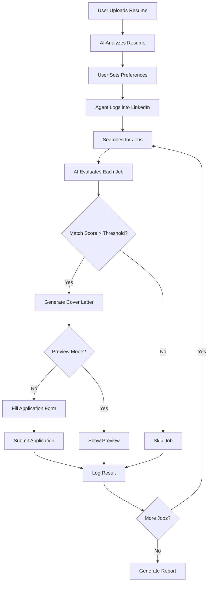

# 🤖 AutoAgentHire - AI-Powered LinkedIn Job Automation

> **Intelligent job application automation using Google Gemini AI, LinkedIn integration, and smart matching algorithms**

[](https://www.python.org/downloads/)
[](https://fastapi.tiangolo.com/)
[](https://streamlit.io/)
[](LICENSE)

---

## 📑 Table of Contents

- [Overview](#-overview)
- [Key Features](#-key-features)
- [Quick Start](#-quick-start)
- [Architecture](#-architecture)
- [How It Works](#-how-it-works)
- [Documentation](#-documentation)
- [Tech Stack](#-tech-stack)
- [Security](#-security)
- [Contributing](#-contributing)
- [License](#-license)

---

## 🌟 Overview

**AutoAgentHire** is an intelligent automation system that revolutionizes the job application process. Using cutting-edge AI technology (Google Gemini), it automatically discovers relevant job opportunities on LinkedIn, evaluates them against your profile, and handles the entire application workflow—from form filling to cover letter generation.

### What Makes It Special?

- **🤖 AI-Powered Decision Making**: Gemini AI evaluates each job's compatibility with your resume
- **✍️ Smart Cover Letters**: Personalized cover letters generated for each application
- **🎯 Intelligent Matching**: Advanced algorithms to find the best job matches
- **🔒 Secure & Private**: Your credentials stay in session memory, never stored
- **👁️ Preview Mode**: Test and evaluate before submitting actual applications
- **📊 Real-Time Tracking**: Watch the automation work with live progress updates

---

## ✨ Key Features

### 🔍 Intelligent Job Discovery
- Automated LinkedIn job search with customizable filters
- "Easy Apply" job filtering
- Location and remote work preferences
- Experience level matching

### 🧠 AI-Powered Analysis
- **Resume Analysis**: Gemini AI extracts skills and experience
- **Job Matching**: AI evaluates compatibility (0-1 score)
- **Smart Decisions**: Should you apply? AI decides based on multiple factors

### ✍️ Automated Application
- **Form Filling**: Automatically fills in application forms
- **Cover Letter Generation**: AI creates personalized, contextual cover letters
- **Question Answering**: Intelligently answers application questions
- **Resume Upload**: Automatic resume attachment

### 📊 Dashboard & Tracking
- Real-time progress monitoring
- Application history and status
- Match score analytics
- Success rate tracking

### 🔐 Security & Safety
- Session-only credential storage
- No password persistence
- Preview mode for safe testing
- Rate limiting to avoid detection
- Human-like interaction patterns

---

## 🚀 Quick Start

### Prerequisites

```bash
# Required
Python 3.11+
Google Gemini API Key

# Optional
OpenAI API Key (fallback)
PostgreSQL (for production)
```

### 1. Installation

```bash
# Clone repository
git clone https://github.com/yourusername/LinkedIn-Job-Automation-with-AI.git
cd LinkedIn-Job-Automation-with-AI

# Run automated setup
python3 setup_complete.py
```

The setup script will:
- Create virtual environment
- Install all dependencies
- Setup Playwright browsers
- Configure environment file
- Create necessary directories

### 2. Configuration

```bash
# Edit .env and add your API key
nano .env

# Add this line:
GOOGLE_API_KEY="your-gemini-api-key-here"
```

Get your Gemini API key: https://makersuite.google.com/app/apikey

### 3. Run

```bash
# Start all services
./startup.sh  # macOS/Linux
# or
startup.bat   # Windows
```

### 4. Access

- **Frontend**: http://localhost:8501
- **API**: http://localhost:8000
- **Docs**: http://localhost:8000/docs

---

## 🏗️ Architecture

```
┌─────────────────────────────────────────────────────────┐
│                    Frontend (Streamlit)                  │
│  • User Interface  • Forms  • Progress Tracking         │
└───────────────────┬─────────────────────────────────────┘
                    │ REST API
┌───────────────────┴─────────────────────────────────────┐
│                  Backend (FastAPI)                       │
│  ┌────────────────────────────────────────────────────┐ │
│  │  API Routes                                        │ │
│  │  /run-agent • /upload-resume • /generate-cover    │ │
│  └────────────────────────────────────────────────────┘ │
│  ┌────────────────────────────────────────────────────┐ │
│  │  Agent Orchestrator                                │ │
│  │  Workflow • State Management • Coordination        │ │
│  └────────────────────────────────────────────────────┘ │
│  ┌──────────┐  ┌──────────┐  ┌──────────┐             │
│  │ Search   │  │ Analysis │  │ Apply    │             │
│  │ Agent    │  │ Agent    │  │ Agent    │             │
│  └──────────┘  └──────────┘  └──────────┘             │
└──────────────────┬──────────────────┬──────────────────┘
                   │                  │
        ┌──────────┴────────┐  ┌──────┴────────────┐
        │  Automation       │  │  AI/LLM Layer     │
        │  • Playwright     │  │  • Gemini API     │
        │  • LinkedIn Bot   │  │  • Matching       │
        │  • Form Filling   │  │  • Generation     │
        └───────────────────┘  └───────────────────┘
```

### Component Details

**Frontend Layer (Streamlit)**
- User-friendly web interface
- Real-time progress tracking
- Interactive forms and dashboards
- Dark/light mode support

**Backend Layer (FastAPI)**
- RESTful API endpoints
- Async task processing
- State management
- Error handling and logging

**Agent Orchestrator**
- Coordinates multiple agents
- Manages workflow execution
- Handles agent communication
- Tracks overall progress

**Automation Layer**
- Playwright browser automation
- LinkedIn interaction
- Form recognition and filling
- Anti-detection measures

**AI/LLM Layer**
- Google Gemini integration
- Resume analysis
- Job matching algorithms
- Text generation (cover letters, answers)

---

## 🔄 How It Works

### End-to-End Workflow



### Step-by-Step Process

1. **Resume Upload & Analysis**
   ```
   User uploads PDF → Extract text → Gemini analyzes → Extract skills/experience
   ```

2. **Job Search**
   ```
   Keywords + Location → LinkedIn search → Filter Easy Apply → Return job list
   ```

3. **AI Evaluation**
   ```
   For each job:
     Job Description + User Resume → Gemini AI → Match Score (0-1)
     If score >= threshold: Proceed to application
   ```

4. **Cover Letter Generation**
   ```
   Job details + Resume + Company info → Gemini → Personalized cover letter
   ```

5. **Form Filling**
   ```
   Navigate to application → Identify fields → Fill with user data
   → Answer questions using AI → Upload resume
   ```

6. **Submission**
   ```
   Preview mode: Show user without submitting
   Full mode: Actually submit application
   ```

7. **Tracking**
   ```
   Log result → Update dashboard → Store for analytics
   ```

---

## 📚 Documentation

| Document | Description |
|----------|-------------|
| [QUICK_START.md](QUICK_START.md) | 5-minute setup and first run guide |
| [COMPLETE_USER_GUIDE.md](COMPLETE_USER_GUIDE.md) | Comprehensive user documentation |
| [API.md](docs/API.md) | API endpoint reference |
| [ARCHITECTURE.md](docs/ARCHITECTURE.md) | Technical architecture details |
| [CONTRIBUTING.md](CONTRIBUTING.md) | Contribution guidelines |

---

## 🛠️ Tech Stack

### Backend
- **FastAPI** - Modern, fast web framework
- **Python 3.11+** - Core language
- **Playwright** - Browser automation
- **Pydantic** - Data validation
- **SQLAlchemy** - Database ORM
- **Celery** - Background tasks

### Frontend
- **Streamlit** - Interactive web UI
- **React** (optional) - Advanced dashboard
- **TailwindCSS** - Styling

### AI & ML
- **Google Gemini** - Primary LLM
- **OpenAI GPT-4** - Fallback LLM
- **LangChain** - LLM framework
- **ChromaDB** - Vector database

### Automation
- **Playwright** - Web automation
- **Selenium** - Alternative automation
- **BeautifulSoup** - HTML parsing

### Infrastructure
- **Docker** - Containerization
- **PostgreSQL** - Production database
- **Redis** - Caching and queuing
- **Nginx** - Reverse proxy

---

## 🔒 Security

### Data Protection
- ✅ **No Password Storage**: Credentials stay in session memory only
- ✅ **Environment Variables**: Sensitive config in .env (never committed)
- ✅ **API Key Encryption**: Keys encrypted at rest
- ✅ **HTTPS Only**: All API calls use secure connections

### Anti-Detection
- ✅ **Human-Like Patterns**: Realistic delays and mouse movements
- ✅ **Rate Limiting**: Prevents excessive requests
- ✅ **Random Delays**: Variable timing to avoid patterns
- ✅ **User-Agent Rotation**: Appears as regular browser

### Best Practices
- Use strong passwords
- Enable 2FA on LinkedIn
- Run on secure networks
- Review logs regularly
- Start with preview mode
- Don't exceed reasonable limits (10-20 apps/day)

---

## 📊 Performance & Limits

### Typical Performance
- **Job Search**: 10-30 seconds for 50 jobs
- **AI Evaluation**: 2-5 seconds per job
- **Cover Letter Generation**: 3-8 seconds
- **Application Submission**: 10-30 seconds per job

### Recommended Limits
- **Daily Applications**: 10-20 (to avoid LinkedIn throttling)
- **Search Results**: 50-100 jobs per search
- **Concurrent Runs**: 1 (avoid parallel sessions)
- **Session Duration**: 1-2 hours max

---

## 🧪 Testing

```bash
# Run unit tests
pytest tests/unit/

# Run integration tests
pytest tests/integration/

# Run with coverage
pytest --cov=backend tests/

# Test specific module
pytest tests/unit/test_gemini_service.py
```

---

## 🤝 Contributing

We welcome contributions! See [CONTRIBUTING.md](CONTRIBUTING.md) for guidelines.

### Quick Contribution Guide

1. **Fork** the repository
2. **Clone** your fork
3. **Create** a feature branch
4. **Make** your changes
5. **Test** thoroughly
6. **Commit** with clear messages
7. **Push** to your fork
8. **Submit** a Pull Request

### Areas for Contribution
- 🐛 Bug fixes
- ✨ New features
- 📝 Documentation improvements
- 🧪 Test coverage
- 🎨 UI/UX enhancements
- 🌍 Translations

---

## 🗺️ Roadmap

### Version 1.1 (Q1 2026)
- [ ] Multi-platform support (Indeed, Glassdoor)
- [ ] Email notifications
- [ ] Advanced analytics dashboard
- [ ] Interview preparation module

### Version 2.0 (Q2 2026)
- [ ] Mobile app (iOS/Android)
- [ ] Voice-based job search
- [ ] Team collaboration features
- [ ] API for third-party integrations

### Version 3.0 (Q3 2026)
- [ ] AI interview assistant
- [ ] Salary negotiation helper
- [ ] Career path recommendations
- [ ] Networking automation

---

## 📄 License

This project is licensed under the MIT License - see the [LICENSE](LICENSE) file for details.

---

## 🙏 Acknowledgments

- **Google Gemini** - AI capabilities
- **Playwright Team** - Browser automation
- **FastAPI** - Backend framework
- **Streamlit** - Frontend framework
- **Open Source Community** - Various libraries and tools

---

## 📞 Support

### Need Help?

- 📖 **Documentation**: Check [QUICK_START.md](QUICK_START.md) or [COMPLETE_USER_GUIDE.md](COMPLETE_USER_GUIDE.md)
- 🐛 **Bug Report**: [Open an issue](https://github.com/yourusername/LinkedIn-Job-Automation-with-AI/issues)
- 💬 **Discussion**: [GitHub Discussions](https://github.com/yourusername/LinkedIn-Job-Automation-with-AI/discussions)
- 📧 **Email**: support@autoagenthire.com

### Frequently Asked Questions

**Q: Is this legal?**
A: Yes, it automates YOUR own job applications using YOUR credentials. However, review LinkedIn's Terms of Service.

**Q: Will LinkedIn detect this?**
A: We use human-like patterns and delays to minimize detection risk, but we cannot guarantee it won't be detected.

**Q: Can I use this for other job platforms?**
A: Currently LinkedIn only. Support for Indeed and Glassdoor is planned for v2.0.

**Q: Do I need coding knowledge?**
A: No! The UI is designed for non-technical users. Just follow the Quick Start guide.

**Q: How much does it cost?**
A: The software is free and open-source. You only need a free Gemini API key (has generous free tier).

---

## 🌟 Star History

If you find this project helpful, please consider giving it a ⭐️!

---

## 📈 Status


---

**Made with ❤️ by the AutoAgentHire Team**

**Last Updated**: October 16, 2025
